  

 

---

### 🧠 About Me

I am a results-oriented **AI & LLM Engineer** specializing in the design and implementation of Retrieval-Augmented Generation (RAG) pipelines and stateful multi-agent architectures. Passionate about local model optimization, I build robust, production-grade systems that bridge the gap between complex LLM reasoning and real-world business applications.

*   🔭 **Currently Building:** A DAX Query Assistant leveraging QLoRA parameter-efficient fine-tuning, hybrid search, and LangGraph-driven state routing.
*   🎓 **Background:** B.Tech in Computer Science & Engineering @ Nalla Narasimha Reddy Education Society's Group of Institutions, Hyderabad (2023–2027).
*   💡 **Interest Areas:** Asynchronous backend engines, local quantization (GGUF/AWQ), vector search spaces, and autonomous agent workflows.

---

### 🛠️ Core Tech Stack

  

---

### 🚀 Featured Projects

<table width="100%">
  <tr>
    <td width="50%" valign="top">
      <h4>🔍 <a href="https://github.com/shashank41105/claims_ollama">ClaimTrackr</a></h4>
      
<i>Multimodal RAG Pipeline for Insurance Claim Document Intelligence</i>

      <ul>
        <li><b>The Problem:</b> Standard text-based parsers fail to extract and reason over structured claim tables, visual receipts, and signatures inside claim PDFs.</li>
        <li><b>The Solution:</b> Built a local multimodal RAG pipeline leveraging <b>LLaVA</b> for visual reasoning, <b>ChromaDB</b> for vector indexing, and <b>Ollama</b> for running inference locally.</li>
      </ul>
      

        
        
        
        
      

    </td>
    <td width="50%" valign="top">
      <h4>🤖 <a href="https://github.com/shashank41105/autonomous-ai-research-agent">Autonomous AI Research Agent</a></h4>
      
<i>LangGraph-Powered Stateful Web Research & Synthesis Agent</i>

      <ul>
        <li><b>The Problem:</b> Conducting comprehensive web research requires continuous, stateful cycles of searching, scraping, validating, and synthesizing.</li>
        <li><b>The Solution:</b> Designed a cyclic multi-agent graph with <b>LangGraph</b> where specialized search and scrape agents pass structured states back and forth to refine a final research report, paired with a 3D Nebula HUD dashboard.</li>
      </ul>
      

        
        
        
      

    </td>
  </tr>
  <tr>
    <td width="50%" valign="top">
      <h4>💬 <a href="https://github.com/shashank41105/slack-ai-data-bot">Slack AI Data Bot</a></h4>
      
<i>Natural Language-to-SQL Interface for Business Intelligence</i>

      <ul>
        <li><b>The Problem:</b> Non-technical business team members often need rapid data insights but lack SQL knowledge to query databases directly.</li>
        <li><b>The Solution:</b> Created an automated Slack bot that translates English questions into secure, optimized SQL queries over PostgreSQL, executes them, and returns readable answers using LangChain and Groq.</li>
      </ul>
      

        
        
        
      

    </td>
    <td width="50%" valign="top">
      <h4>📊 <a href="https://github.com/shashank41105/Momentum">Momentum</a></h4>
      
<i>Daily Performance Tracker & Behavioral Consistency Engine</i>

      <ul>
        <li><b>The Problem:</b> Personal tracking apps are often cluttered, gamified, and lack a single unified formula to calculate actual daily discipline.</li>
        <li><b>The Solution:</b> Developed a minimalist, high-end editorial log tracker that converts daily work focus, gym effort, and diet discipline into a mathematical compound score.</li>
      </ul>
      

        
        
        
      

    </td>
  </tr>
</table>

---

### 📊 Contribution Activity

  

---

### 📈 GitHub Analytics

  
  

---

### 🐍 Activity Heatmap

  

---

  <h3>💡 <i>"The best way to predict the future is to build it."</i></h3>

