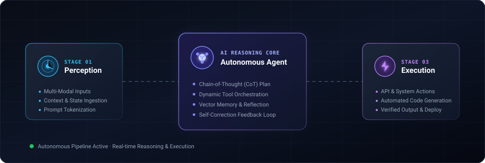
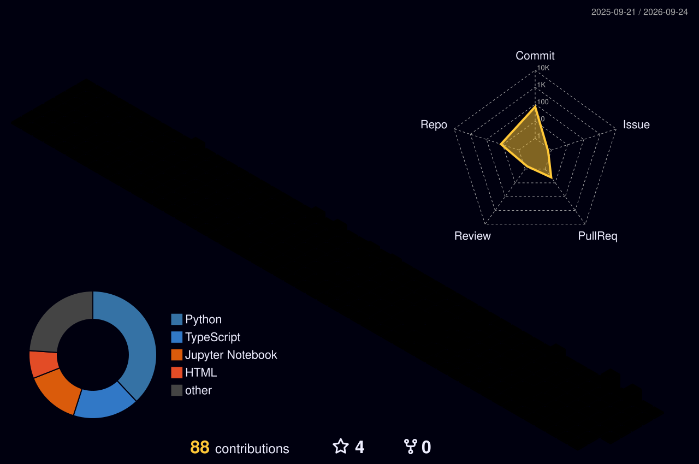

  

 

  

  

### About

CSE student at **Nalla Narasimha Reddy Education Society's Group of Institutions, Hyderabad (2023–2027)**. I design production-shaped AI systems: stateful multi-agent graphs, retrieval pipelines, and Slack-native tools that actually take action — not just generate text.

I care about the unglamorous parts that make agents usable: approval gates, allowlists, fallbacks across model providers, and deterministic quality checks around the LLM.

- **Building now:** [ChaosMind](https://github.com/shashank41105/ChaosMind) — a LangGraph chaos-engineering loop that hypothesizes failures, injects faults in Docker, judges the blast, then opens a GitHub PR with a patch.
- **Focus:** agent orchestration, RAG, local inference, FastAPI backends, and reliability automation for DevOps / SRE workflows.
- **Open to:** internships and build-heavy roles in AI systems, agent platforms, and applied LLM engineering.

  

### How I think about systems

  

  

### Stack

  

 

  

  

### Featured work

<table>
  <tr>
    <td width="50%" valign="top">
      <h3><a href="https://github.com/shashank41105/ChaosMind">ChaosMind</a></h3>
      
<b>Multi-agent chaos engineering and autonomous remediation</b>

      
A Docker-sandboxed LangGraph system that plans a failure hypothesis, waits for a Slack approval gate, injects a precise fault, monitors anomalies, writes a code patch, and opens a GitHub pull request after a deterministic quality gate.

      

        
        
        
        
        
      

    </td>
    <td width="50%" valign="top">
      <h3><a href="https://github.com/shashank41105/ZeroMTTR">ZeroMTTR</a></h3>
      
<b>AI incident commander for SRE teams</b>

      
Event-driven Slack gateway that triages alerts, retrieves runbooks from pgvector, proposes a fix with human approval, posts stakeholder updates, and commits a Markdown post-mortem to GitHub. Multi-provider LLM routing across Groq, Gemini, and OpenAI.

      

        
        
        
        
      

    </td>
  </tr>
  <tr>
    <td width="50%" valign="top">
      <h3><a href="https://github.com/shashank41105/claims_ollama">ClaimTrackr</a></h3>
      
<b>Multimodal RAG for insurance claim documents</b>

      
Local pipeline that reasons over claim PDFs — tables, receipts, and signatures — using LLaVA for vision, ChromaDB for retrieval, and Ollama for on-device inference instead of a cloud-only parser.

      

        
        
        
        
      

    </td>
    <td width="50%" valign="top">
      <h3><a href="https://github.com/shashank41105/autonomous-ai-research-agent">Autonomous Research Agent</a></h3>
      
<b>Stateful web research and synthesis</b>

      
Cyclic LangGraph of search and scrape agents that pass structured state until a report is ready, served through FastAPI and a 3D nebula HUD. Built for long-running research, not one-shot chat.

      

        
        
        
        
      

    </td>
  </tr>
  <tr>
    <td width="50%" valign="top">
      <h3><a href="https://github.com/shashank41105/slack-ai-data-bot">Slack AI Data Bot</a></h3>
      
<b>Natural language to SQL for business teams</b>

      
Slash-command bot that turns English questions into SQL over PostgreSQL via LangChain and Groq, then returns readable answers in Slack. Also mirrored as an n8n workflow for a low-code path.

      

        
        
        
        
      

    </td>
    <td width="50%" valign="top">
      <h3><a href="https://github.com/shashank41105/Momentum">Momentum</a></h3>
      
<b>Daily performance tracker</b>

      
Minimal TypeScript app that folds work focus, gym effort, and diet into one compound score — morning intent, honest logging, evening reflection. Built as a product, not a habit-app clone.

      

        
        
        
      

    </td>
  </tr>
</table>

  

### Activity

  

 

  
  

 

  

  

### Contribution snake

  

  

  <i>If the system cannot recover itself, the design is unfinished.</i>
    
  <a href="https://github.com/shashank41105?tab=repositories">See all repositories</a>
  ·
  <a href="https://linkedin.com/in/padala-sai-shashank-300a3b261">Connect on LinkedIn</a>

